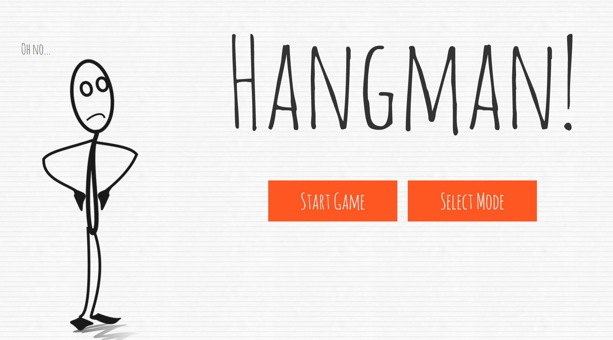
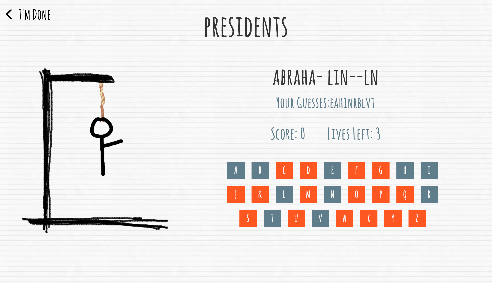

# Hangman
A Javascript-based Hangman game created for a class project (EECS 368 - Programming Languages and Paradigms)

[Click here to see the page!](http://sharynneazhar.github.io/project_hangman/)

#### The Team
* Sharynne Azhar - responsible for the visual styling and graphics
* Levi Clark - responsible for the word bank and a "Create Your Own Word Bank" feature
* Zackery Mryyan - responsible for the game engine
* Denis Sehic - responsible for the AI

#### Features
* Single Player mode
* Bot mode with easy or hard difficulty
* Create your own wordbank!

#### Screenshots
######Home View

######Game View

